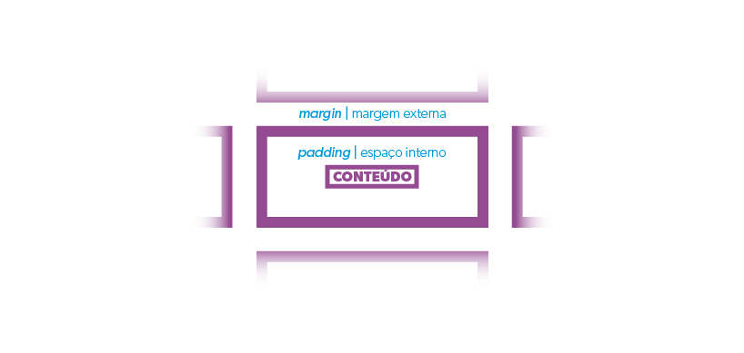

# Curso HTML, CSS e JS Básico

## Aula 08 - Introdução ao CSS

### **Objetivo da aula**

Esta aula teve como objetivo principal lhe apresentar o conceito básico de CSS, assim como iniciar o processo de modificações e criação de regras visuais para nossos documentos HTML.

---

### **Conteúdo abordado**

Comecei esta aula criando uma nova pasta, a pasta **css**, para que possamos criar nossos estilos diretamente no arquivo **[style.css](https://github.com/evandrofalleiros/curso-html-css-js-basico-youtube/blob/aula-08/css/style.css)**

Introduzi, de forma bem rápida, o conceito de CSS. De forma simplificada, estamos o entendendo como uma forma de explicitarmos regras visuais que devem ser aplicadas no nosso documento HTML. 

Nesse sentido, iniciamos com duas seleções básica:

1. **Seleção universal**: faz a seleção de todos os elementos do seu documento HTML. A seguir, você pode observar o código trabalhado em aula. Na ocasião, decidi "zerar" as margens (**margin**) e os espaçamentos internos (**padding**) de todos os elementos do documento, para que possamos, posteriormente, decidir os aspectos visuais por nossa conta. Isso se chama **liberdade**!

```css
*{
    margin: 0;
    padding: 0;
}
```
Já que falei sobre essas duas propriedades, **margin** e **padding**, deixo aqui uma figura que representa bem o modelo visual adotado, por padrão, pelo navegador:



2. **Seleção pelo nome dos elementos**: você pode selecionar todas as ocorrências de um determinado elemento dentro do seu documento HTML. No caso abaixo, selecionamos o elemento **\<body\>** e alteramos sua família de fonte. Com isso, todos os elementos descendentes do elemento **\<body\>** passaram a herdar essa mesma fonte.

```css
body{
    font-family: 'Open Sans', sans-serif;
}
``` 

A fonte *Open Sans* foi incorporada no nosso documento mesmo sem estar fisicamente presente na estrutura de pastas do projeto iniciado. Para tal, fizemos a incorporação de uma fonte web externa gratuita, que pode ser acessada [aqui](https://fonts.google.com/?selection.family=Open+Sans).

Quando não é possível o acesso à rede, por falta de conexão à Internet, por exemplo, a fonte **sans-serif** é carregada por padrão pelo seu navegador. 

Essa fonte é uma das várias fontes que estão presentes nativamente nos mais diversos navegadores web. Para conhecer outras fontes como essa (*Web Safe Fonts* - fontes seguras para a web), acesse esse [link](https://www.w3schools.com/cssref/css_websafe_fonts.asp).

---

Qualquer dúvida, entre em contato comigo pelo e-mail evandro.falleiros@ifms.edu.br. Até a próxima aula!